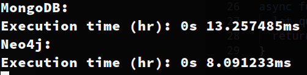

### selecting relevant database operations, which can be used to compare the databases

Vi har valgt at kigge på disse oprationer. Single read, mass read, space complexity. Til disse tager vi udgangspunkt i data der omhandler netflix serie og shows. Der er cirka 6000 shows, samt deres skuespiller og instruktører. Mongo kan loade dataen ind som den er. Med neo4j har vi været nød til at lave et script der kan converter dette om til cypher instruktioner, som neo4j kan forstå.

### selecting appropriate criteria for comparison, such as access time, storage space, complexity, versioning, security, or similar

#### - Single read

Her kan vi ses at neo4j kan læse et enkelt dokument hurtigere op end mongo. Dette skyldes at neo4j ofre noget plads for ekstra hastighed.

#### - Mass read

Her vinder mongo klart. Dette skyldes at mongo kan læse et show samt dens "actors" or "directors" op i et hug, hvorimod neo4j skal læse et show op og derefter findes dens relations til "actors" og "directors" og samle det i et enkelt svar.

#### - Space complexity

Som nævnt oven for bruger neo4j mere plads end mongo for at op nå bedre hastighed. Dette gør den blandt andet ved at gemme sine relations mellem noderne, dette anvendes også til neo4j algoritmer. Mongo på den anden side har "kun" brug for at gemme selve daten samt index. Mongo kan dog godt komme til at fylde meget da det er okay at have duplikerende og embeded data.

#### creating demo code for testing the selected database operations against the selected comparison criteria

Inde i file main.js kan man se eksempler på single read, og mass reads, med tilsvarende speed test.

#### reporting the results and conclusions.

Disse databaser deler principer, f.eks skalerer de begge to ved hjælp af sharding. De er begge schemaless og høre til no-sql kategorien, dog har de også deres egne usecases. Har du brug for at opbevare data og have det let og hurtigt tilgængeligt, er mongodb at fortrække. Hvis du derimod har brug for at lave mange single read, og ikke er så bekymret med henblik på plads er neo4j noget for dig. Dog er den helt store fordel ved at bruge neo4j dens indbyggede mulighed for at bruge mange populare algroritmer til at under søge eller analyser dataen f.eks. dijkstra's.
